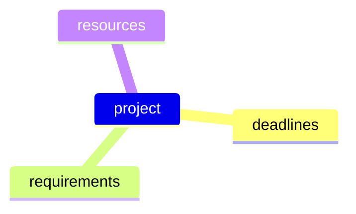

# The Problem
In an ideal world, within a project everything perfectly fits together ...

    ... but in reality - as incidents occur along the way - you need to be flexible in at least one of these aspects!

